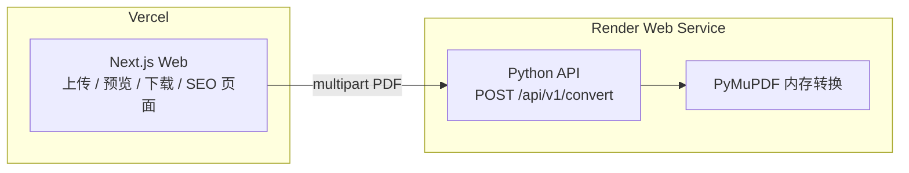
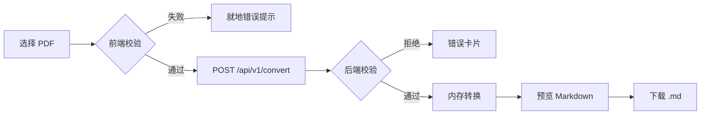

# PDF a MD — 产品需求文档（PRD）

| 字段 | 内容 |
|------|------|
| **产品名称** | PDF a MD |
| **域名** | [pdfamd.com](https://pdfamd.com) |
| **文档版本** | v1.0 |
| **最后更新** | 2026-07-15 |
| **状态** | 已确认，待开发 |
| **运营主体** | 个人开发者（无注册公司） |

---

## 1. 概述

### 1.1 产品定位

PDF a MD 是一款免费的在线 **PDF 转 Markdown** 工具。用户上传文本型 PDF，在浏览器中预览转换结果，并下载 `.md` 文件。品牌主显 **PDF a MD**，副显 **pdf to md / pdf to markdown**，面向全球英文用户，并辅以西语落地页覆盖 **pdf a md** 搜索意图。

### 1.2 问题与价值

| 用户痛点 | 产品价值 |
|----------|----------|
| 需要从 PDF 提取可编辑文本到笔记/文档工具 | 一键转 Markdown，兼容 Obsidian、Notion、VS Code 等 |
| 现有工具过重、需安装或注册 | 浏览器即用，MVP 无需注册 |
| 担心隐私 | 内存处理，请求结束后不持久化存储 |

### 1.3 MVP 目标

**验证产品闭环**，不追求转换质量上限：

1. **上传** — 用户可选择 PDF，获得明确校验反馈
2. **预览** — 转换结果在页面上可读（渲染视图 + 源码视图）
3. **下载** — 一键下载 `.md` 文件

### 1.4 非目标（MVP 不做）

- 用户账号 / 登录
- 历史记录 / 云存储
- OCR / 扫描件支持
- 批量转换
- 付费订阅
- 复杂版式还原（多栏、公式、精细表格）
- 多语言全站翻译（MVP 仅 `/` 英文 + `/es` 西语 Hero/FAQ/Limits）

---

## 2. 目标用户

| 人群 | 场景 |
|------|------|
| 开发者 | 将技术文档 PDF 迁入 GitHub / 文档站 |
| 笔记用户 | 导入 Obsidian、Notion |
| 内容工作者 | 快速提取文稿进行二次编辑 |
| 西语用户 | 搜索「pdf a md」「convertir pdf a md」 |

---

## 3. 技术方案

### 3.1 架构总览

采用 **Vercel（前端）+ Render（Python API）** 分离部署。用户可接受 Render 免费层冷启动延迟。



### 3.2 职责划分

| 层级 | 职责 | 技术 |
|------|------|------|
| **Web（Vercel）** | UI、前端校验、Markdown 预览与下载、SEO 静态页、Privacy/Terms | Next.js（推荐） |
| **API（Render）** | 后端校验、扫描件检测、PyMuPDF 转换、返回 JSON | Python + FastAPI/Flask + PyMuPDF |

### 3.3 核心原则

- **内存处理**：`bytes → fitz.open(stream=...) → markdown string → JSON`，不写磁盘、不用对象存储
- **API 契约先行**：Web 层不直接依赖 PyMuPDF；仅通过 HTTP 调用转换 API，便于日后迁移 Worker（Railway/Fly.io 等）
- **环境变量**：`CONVERT_API_BASE_URL` 指向 Render 服务地址

### 3.4 演进路径

| 触发条件 | 动作 |
|----------|------|
| 需更大文件 / 更长处理时间 | 升级 Render 实例或迁 Worker |
| 需 OCR / 批量 / 队列 | 独立 Worker，Vercel 仍只留前端 |
| PyMuPDF 质量不足 | 替换转换引擎，**API 接口保持不变** |

---

## 4. 功能需求

### 4.1 用户流程



### 4.2 上传

| ID | 需求 | 优先级 |
|----|------|--------|
| F-01 | 支持点击选择与拖拽上传 | P0 |
| F-02 | 空态展示限额说明（10MB / 50 页 / 不支持扫描件） | P0 |
| F-03 | 前端预校验：文件类型、大小（后端二次校验） | P0 |
| F-04 | 上传后展示文件名、大小、页数（页数可由前端读 metadata 或 API 返回） | P1 |
| F-05 | 「Convert another file」重置状态 | P0 |

### 4.3 转换

| ID | 需求 | 优先级 |
|----|------|--------|
| F-06 | 调用 Render API 进行转换 | P0 |
| F-07 | 加载态文案 + 冷启动提示（最长约 30s） | P0 |
| F-08 | 转换成功返回 Markdown 文本与 meta | P0 |

### 4.4 预览

| ID | 需求 | 优先级 |
|----|------|--------|
| F-09 | Tab 切换：`Preview`（渲染）/ `Markdown`（源码） | P0 |
| F-10 | Preview 使用安全渲染（防 XSS） | P0 |

### 4.5 下载

| ID | 需求 | 优先级 |
|----|------|--------|
| F-11 | 主 CTA「Download .md」，文件名为 `{原文件名}.md` | P0 |
| F-12 | 内容来自当次 API 响应，无服务端存档 | P0 |

### 4.6 多语言（MVP 范围）

| 路径 | 范围 |
|------|------|
| `/` | 英文全页（工具 + SEO 内容区 + FAQ） |
| `/es` | 西语 Hero、工具区文案、FAQ、Limits；Privacy/Terms 链英文页 |
| `/privacy` | 英文 Privacy Policy |
| `/terms` | 英文 Terms of Service |

语言切换：Footer `EN` / `ES`（或 Header 切换）。

---

## 5. 产品限制与校验

### 5.1 限额（MVP 固定）

| 限制项 | 值 | 说明 |
|--------|-----|------|
| 单文件大小 | **10 MB** | Render 方案下可执行；前后端双重校验 |
| 最大页数 | **50 页** | 预防超时与 OOM |
| 文件类型 | 文本型 PDF | 不支持扫描件 / 纯图片 PDF |
| 加密 PDF | 不支持 | 单独错误码 |
| 注册 | 不需要 | — |

### 5.2 扫描件检测（需求级）

- 统计可提取文本量（全页或抽样）
- 文本密度低于阈值 → 拒绝，错误码 `SCANNED_PDF_DETECTED`
- 用户文案强调：「仅支持可选中文字的 PDF」，MVP 不提供 OCR

### 5.3 统一错误响应结构

```json
{
  "ok": false,
  "code": "PAGE_LIMIT_EXCEEDED | FILE_TOO_LARGE | SCANNED_PDF_DETECTED | INVALID_PDF | CONVERSION_FAILED",
  "message": "Human-readable message",
  "limits": { "maxBytes": 10485760, "maxPages": 50 }
}
```

### 5.4 错误文案（英文）

| code | 标题 | 说明 |
|------|------|------|
| FILE_TOO_LARGE | File too large | Maximum file size is 10MB. Try a smaller PDF or split the document. |
| PAGE_LIMIT_EXCEEDED | Too many pages | Maximum is 50 pages for this version. Try splitting your PDF first. |
| SCANNED_PDF_DETECTED | Scanned PDF detected | This tool only supports text-based PDFs. OCR is not available yet. |
| INVALID_PDF | Unable to read PDF | The file may be corrupted, password-protected, or not a valid PDF. |
| CONVERSION_FAILED | Conversion failed | Something went wrong. Please try again in a moment. |

西语错误文案见 [附录 C](#附录-c-西语页面文案摘要)。

---

## 6. API 规格

### 6.1 转换接口

```
POST /api/v1/convert
Content-Type: multipart/form-data

字段:
  file: <pdf binary>
```

**成功响应 200：**

```json
{
  "ok": true,
  "markdown": "# Title\n\n...",
  "meta": {
    "pages": 12,
    "title": "Document Title",
    "converter": "pymupdf",
    "version": "0.1.0"
  }
}
```

### 6.2 CORS

- Render API 允许来源：`https://pdfamd.com`（及 Vercel 预览域名，开发环境可配置）
- 方法：`POST`
- 头：`Content-Type`

### 6.3 健康检查（建议）

```
GET /health
→ 200 { "ok": true }
```

用于 Render 探活与监控。

---

## 7. 非功能需求

| 类别 | 要求 |
|------|------|
| **隐私** | PDF 仅在请求生命周期内存在于内存；响应后丢弃；不建用户文档库 |
| **安全** | HTTPS；校验 MIME/魔数；限制 Content-Length；预览 sanitize；拒绝加密 PDF |
| **性能** | 在限额内单次转换于 Render 超时配置内完成；首请求允许冷启动 ≤30s |
| **可用性** | 错误态可恢复（重试 / 换文件）；不静默失败 |
| **可观测** | 记录耗时、页数、拒绝原因码；**不记录**文件内容与 Markdown 正文 |
| **成本** | 无 DB、无对象存储；按调用计费 |
| **SEO** | 营销内容与 H1/FAQ 须 SSR/SSG 可索引 |

---

## 8. SEO 需求

### 8.1 关键词策略

| 层级 | 关键词 |
|------|--------|
| 品牌主词 | pdf a md, PDF a MD |
| 核心英文 | pdf to md, pdf to markdown |
| 长尾 | convert pdf to markdown online, pdf to md free |
| 西语 | pdf a md, pdf a markdown, convertir pdf a md |

### 8.2 英文首页（`/`）SEO 配置

| 字段 | 内容 |
|------|------|
| Title | `PDF a MD — Free PDF to Markdown Converter \| pdfamd.com` |
| Meta description | `Convert PDF to Markdown (MD) online at pdfamd.com. Upload, preview, and download .md files free. Text-based PDFs only — no signup required.` |
| Canonical | `https://pdfamd.com/` |
| H1 | `PDF a MD` |
| html lang | `en` |

### 8.3 西语页（`/es`）SEO 配置

| 字段 | 内容 |
|------|------|
| Title | `PDF a MD — Convertidor gratuito de PDF a Markdown \| pdfamd.com` |
| Meta description | `Convierte PDF a Markdown (MD) gratis en pdfamd.com. Sube, previsualiza y descarga archivos .md. Solo PDFs con texto — sin registro.` |
| Canonical | `https://pdfamd.com/es` |
| H1 | `PDF a MD` |
| html lang | `es` |

### 8.4 hreflang

```html
<link rel="alternate" hreflang="en" href="https://pdfamd.com/" />
<link rel="alternate" hreflang="es" href="https://pdfamd.com/es/" />
<link rel="alternate" hreflang="x-default" href="https://pdfamd.com/" />
```

### 8.5 页面结构（英文 `/`）

| 区块 | H 标签 / 说明 |
|------|----------------|
| Hero + 工具 | H1: PDF a MD |
| 引言 | H2: Free PDF to MD Converter |
| 步骤 | H2: How to Convert PDF to Markdown |
| 卖点 | H2: Why Use PDF a MD? |
| 限额 | H2: Limits & Supported PDFs |
| 问答 | H2: FAQ |

### 8.6 结构化数据（JSON-LD）

| 类型 | 要求 |
|------|------|
| WebApplication | name: PDF a MD；url: pdfamd.com；offers: 免费 |
| FAQPage | 与页面可见 FAQ **逐字一致** |
| HowTo（可选） | 3 步：Upload → Preview → Download |

### 8.7 技术 SEO

- `robots.txt`：Allow `/`
- `sitemap.xml`：`/`、`/es`、`/privacy`、`/terms`
- `www` 与裸域统一跳转
- OG 图：1200×630，文案 PDF → MD + pdfamd.com
- Lighthouse SEO 项目标满分；Performance 尽量 ≥90

### 8.8 完整英文营销文案

见 [附录 A](#附录-a-英文首页文案)。

---

## 9. UI/UX 设计规范

### 9.1 视觉方向

| 维度 | 规范 |
|------|------|
| 气质 | Clean utility（偏 Linear / Vercel 文档风） |
| 背景 | 浅色为主 `#FAFAF9` 或 `#F8FAFC` |
| 主色 | 深蓝 `#1E3A5F` 或墨绿 `#0F766E` |
| 强调色 | 琥珀 `#F59E0B` 或珊瑚 `#EA580C`，仅 CTA / 拖拽高亮 |
| 正文色 | `#0F172A`；次要 `#64748B` |
| 字体 | 无衬线 Inter / Geist；MD 预览等宽 JetBrains Mono |
| 圆角 | 卡片 14px；按钮 8–10px |
| 避免 | 满屏 AI 紫渐变、注册弹窗墙 |

### 9.2 桌面布局

```
┌─────────────────────────────────────────────────────────────┐
│  [Logo] PDF a MD     How it works   FAQ   Limits    [GitHub]│
├─────────────────────────────────────────────────────────────┤
│  H1: PDF a MD                                               │
│  Convert PDF to Markdown Online — Free                      │
│  Text-based PDFs · Preview before download · No signup      │
│  ┌─────────────────────────────────────────────────────┐   │
│  │              [ 上传区 / 预览区 / 下载 ]                │   │
│  │  Max 10MB · Up to 50 pages · Scanned PDFs not supported│
│  └─────────────────────────────────────────────────────┘   │
├─────────────────────────────────────────────────────────────┤
│  SEO 内容区：How it works / Why / Limits / FAQ              │
├─────────────────────────────────────────────────────────────┤
│  © PDF a MD · pdfamd.com · Privacy · Terms · Español       │
│  Operated by an individual developer.                       │
└─────────────────────────────────────────────────────────────┘
```

移动端：Hero → 上传全宽 → 预览/下载纵向 → FAQ 手风琴。

### 9.3 关键状态

| 状态 | 行为 |
|------|------|
| 空态 | 虚线框 + 拖拽高亮 |
| 加载 | Spinner +「First request may take up to 30 seconds」 |
| 成功 | Preview / Markdown Tab + Download .md |
| 错误 | Inline alert，标题 + 一行解决建议 |

### 9.4 设计 Token

```css
--bg: #FAFAF9;
--surface: #FFFFFF;
--text: #0F172A;
--text-muted: #64748B;
--primary: #1E3A5F;
--accent: #F59E0B;
--border: #E2E8F0;
--success: #059669;
--error: #DC2626;
--radius-card: 14px;
```

---

## 10. 法律与合规

### 10.1 运营主体

- **个人开发者**运营，**无注册公司**
- 站点表述：*Operated by an individual developer*
- 联系邮箱：**shua6715@gmail.com**（Privacy 与 Terms 共用）

### 10.2 页面

| URL | 说明 |
|-----|------|
| `/privacy` | 英文 Privacy Policy（个人开发者版） |
| `/terms` | 英文 Terms of Service（个人开发者版） |

### 10.3 关键法律表述

- 人称统一 **I / me / my**
- 不上传敏感文档的用户提示（医疗 / 法律 / 金融）
- 免费服务、责任上限 **USD $0**
- 争议：先邮件协商；无法解决时适用运营者常住地法律（页面上不公开具体国家）
- 西语页：*Política de privacidad y términos disponibles en inglés.*

### 10.4 完整法律正文

见 [附录 B](#附录-b-privacy-policy-与-terms-of-service)。

---

## 11. 部署与配置

### 11.1 Vercel（前端）

| 项 | 配置 |
|----|------|
| 框架 | Next.js |
| 环境变量 | `CONVERT_API_BASE_URL` |
| 域名 | pdfamd.com |
| 构建 | 营销页 SSG；工具区 Client Component |

### 11.2 Render（API）

| 项 | 配置 |
|----|------|
| 类型 | Web Service |
| 运行时 | Python 3.11+ |
| 依赖 | PyMuPDF 等（`requirements.txt` 或 Docker） |
| 内存 | 建议 ≥ 512MB，推荐 1GB |
| 冷启动 | 免费层可接受；UI 已提示 |
| CORS | 仅允许 pdfamd.com |

### 11.3 仓库结构（建议）

```
pdf-to-md/
├── apps/web/          # Next.js 前端
├── services/api/      # Python 转换 API
├── docs/
│   └── PRD.md         # 本文档
└── README.md
```

---

## 12. 转换质量预期

| 能较好处理 | 已知短板 |
|------------|----------|
| 纯文本、简单标题 | 多栏、复杂表格 |
| 基础段落 | 页眉页脚、脚注 |
| 简单列表 | 公式、图表语义 |
| | 目录层级推断弱 |

**产品承诺文案：** *Quick text extraction to Markdown — layout fidelity not guaranteed.*

---

## 13. 里程碑与验收标准（DoD）

### 13.1 MVP 完成定义

- [ ] 用户在 `pdfamd.com` 完成：上传 → 预览 → 下载 `.md`
- [ ] 超大小、超页数、扫描件、损坏/加密 PDF 均有明确英文提示；西语页对应文案
- [ ] 全程无服务端持久化文件
- [ ] Vercel + Render 双端部署成功，CORS 与 HTTPS 正常
- [ ] `/`、`/es`、`/privacy`、`/terms` 可访问
- [ ] Title / Meta / H1 / FAQ 与 JSON-LD 一致
- [ ] Privacy / Terms 含个人开发者声明与 shua6715@gmail.com
- [ ] Footer 含 *Operated by an individual developer*
- [ ] 限额与 PRD 一致：10MB / 50 页

### 13.2 建议排期（参考）

| 阶段 | 内容 | 预估 |
|------|------|------|
| M1 | Render API + PyMuPDF 转换 + 校验 | 2–3 天 |
| M2 | Next.js 工具页 + 预览/下载 | 2–3 天 |
| M3 | SEO 内容区 + `/es` + 结构化数据 | 1–2 天 |
| M4 | Privacy/Terms + 部署 + 联调 | 1 天 |

---

## 14. 风险与缓解

| 风险 | 影响 | 缓解 |
|------|------|------|
| Render 免费层冷启动 30s+ | 首次体验差 | UI 明示；可考虑日后 Starter  Plan |
| 扫描件误判 | 图文混排被拒 | 可调阈值；错误文案引导 |
| Markdown XSS | 预览安全风险 | sanitize 渲染 |
| 转换超时 | 大页数失败 | 页数限额 + 监控 |
| 个人开发者法律责任 | 合规压力 | 保守 Terms、不收集多余数据、敏感文档提示 |
| PyMuPDF 质量不足 | 用户失望 | 文案降预期；保留 API 可换引擎 |

---

## 15. 未来路线图（Post-MVP）

1. Render Starter / 更大限额（20MB、100 页）
2. OCR 支持（独立 Worker）
3. `/es/privacidad`、`/es/terminos` 西语法律页
4. 批量转换、API Key 开放
5. 博客 / Changelog SEO 内容
6. 对比页与更多长尾落地页

---

## 16. 决策记录

| 日期 | 决策 | 理由 |
|------|------|------|
| 2026-07-15 | MVP 不在 Vercel 跑 Python | 4.5MB 与超时限制过严 |
| 2026-07-15 | 采用 Vercel + Render | 前端 SEO 友好 + Python 转换自由度 |
| 2026-07-15 | 可接受冷启动 | 个人项目成本优先 |
| 2026-07-15 | 品牌主显 A：PDF a MD | 域名 pdfamd.com 一致 |
| 2026-07-15 | 限额 10MB / 50 页 | 平衡体验与 Render 资源 |
| 2026-07-15 | 个人开发者法律主体 | 无注册公司，Terms/Privacy 用 I/me |
| 2026-07-15 | 联系邮箱 shua6715@gmail.com | 单邮箱简化运营 |

---

## 附录 A：英文首页文案

### Hero

- **H1:** PDF a MD
- **副标题:** Convert PDF to Markdown Online — Free
- **支持行:** Text-based PDFs · Preview before download · No signup
- **上传主文案:** Drop your PDF here or click to upload
- **上传次文案:** Free pdf to md conversion in seconds
- **限额:** Max 10MB · Up to 50 pages · Scanned PDFs not supported
- **加载:** Converting your PDF… This may take up to 30 seconds on the first request.

### H2: Free PDF to MD Converter

PDF a MD is a free online tool to convert PDF to Markdown. Whether you call it **pdf a md** or **pdf to md**, the goal is the same: turn your document into clean, editable `.md` text you can use in Obsidian, Notion, GitHub, or any Markdown editor.

Upload your file at **pdfamd.com**, preview the result, and download — no account, no installation.

### H2: How to Convert PDF to Markdown

1. **Upload** — Choose a text-based PDF (max 10MB, up to 50 pages).
2. **Preview** — Check the preview or view the raw Markdown source.
3. **Download** — Click **Download .md** to save your file.

### H2: Why Use PDF a MD?

- **Fast pdf to md workflow** — Upload, preview, download.
- **Preview before you download** — See exactly what your Markdown looks like.
- **Privacy-first** — Processed in memory, not stored after the request.
- **Built for text PDFs** — Reports, exports, ebooks, technical docs.

### H2: Limits & Supported PDFs

**Supported:** selectable text, ≤10MB, ≤50 pages, unencrypted PDFs.

**Not supported (MVP):** scanned/image-only PDFs, password-protected PDFs, OCR.

### H2: FAQ

1. **What does “pdf a md” mean?** — Converting PDF to Markdown (`.md`).
2. **Is PDF a MD free?** — Yes, no signup.
3. **How is this different from “pdf to md”?** — Same thing; PDF a MD is the brand name.
4. **Does it work with scanned PDFs?** — No OCR in MVP.
5. **What’s the maximum file size and page count?** — 10MB and 50 pages.
6. **Is my PDF stored on your server?** — No, in-memory only.
7. **Why is the first conversion sometimes slow?** — Service wake-up after idle.
8. **What Markdown flavor do you output?** — Common Markdown compatible with most editors.
9. **Can I use the output in Obsidian / Notion / VS Code?** — Yes.

### Footer

```
© 2026 PDF a MD · pdfamd.com
Privacy · Terms · Español
Operated by an individual developer.
```

---

## 附录 B：Privacy Policy 与 Terms of Service

完整正文见项目内独立文件（便于法务页直接引用）：

- [docs/legal/privacy.md](./legal/privacy.md)
- [docs/legal/terms.md](./legal/terms.md)

---

## 附录 C：西语页面文案摘要

### Hero（`/es`）

- **副标题:** Convierte PDF a Markdown online — Gratis
- **支持行:** PDFs con texto seleccionable · Vista previa antes de descargar · Sin registro
- **上传:** Arrastra tu PDF aquí o haz clic para subir
- **限额:** Máx. 10 MB · Hasta 50 páginas · No compatible con PDFs escaneados
- **加载:** Convirtiendo tu PDF… La primera solicitud puede tardar hasta 30 segundos.

### H2: Convertidor gratuito de PDF a MD

**PDF a MD** es una herramienta online gratuita para **convertir PDF a Markdown**. Si buscas **pdf a md**, **pdf a markdown** o **convertir pdf a md**, sube tu archivo en **pdfamd.com**, previsualiza y descarga tu `.md`.

### FAQ（9 问）

1. ¿Qué significa “pdf a md”?
2. ¿PDF a MD es gratis?
3. ¿En qué se diferencia de “pdf to md”?
4. ¿Funciona con PDFs escaneados?
5. ¿Cuál es el tamaño máximo y el número de páginas?
6. ¿Guardan mi PDF en el servidor?
7. ¿Por qué la primera conversión a veces es lenta?
8. ¿Qué tipo de Markdown generan?
9. ¿Puedo usar el resultado en Obsidian, Notion o VS Code?
10. ¿Necesito crear una cuenta?

（完整西语 FAQ 全文见 PRD 讨论稿；实现时与 JSON-LD 逐字一致。）

### Footer

```
© 2026 PDF a MD · pdfamd.com
Privacy · Terms · English
Operado por un desarrollador individual.
```

---

## 附录 D：OG 图规范

| 项 | 值 |
|----|-----|
| 尺寸 | 1200 × 630 |
| 文案 | PDF a MD / pdfamd.com / Free PDF to Markdown / Upload · Preview · Download |
| 风格 | 主色深蓝或墨绿，强调色仅用于 Download 按钮示意 |

---

*本文档由产品讨论整理生成，作为 pdfamd.com MVP 的单源需求参考。实现阶段若偏离本文档，应更新 PRD 版本号与决策记录。*
